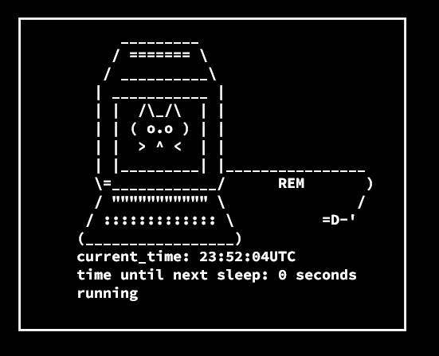

# REM - WIN32 API

## Compiling the program
Compile the program with make

```
make build
```
## Running the program
```
make run
```
## Using the program
This program is designed to run in the background within a terminal.

Press F12 to stop the infinite volume toggle and F2 to restart it. This will keep your computer from falling asleep.

## What it looks like in terminal with ncurses


## WIN32 API Docs
https://learn.microsoft.com/en-us/windows/win32/
